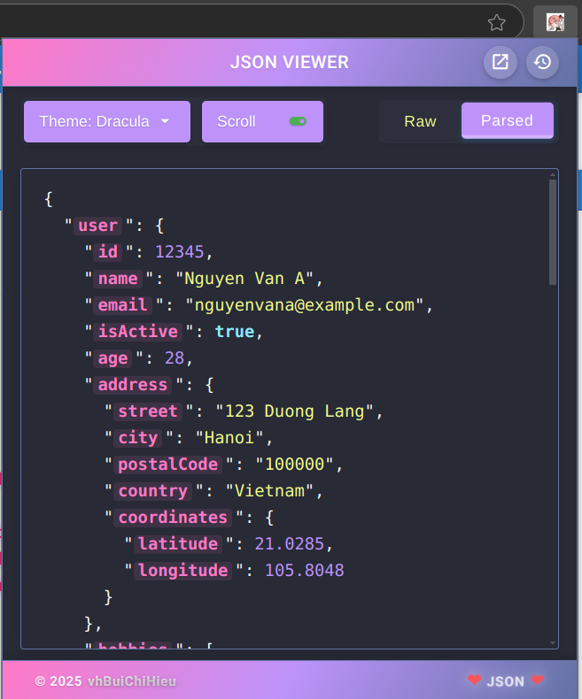
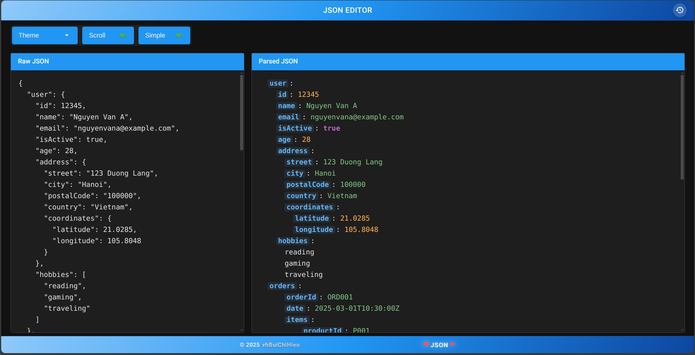
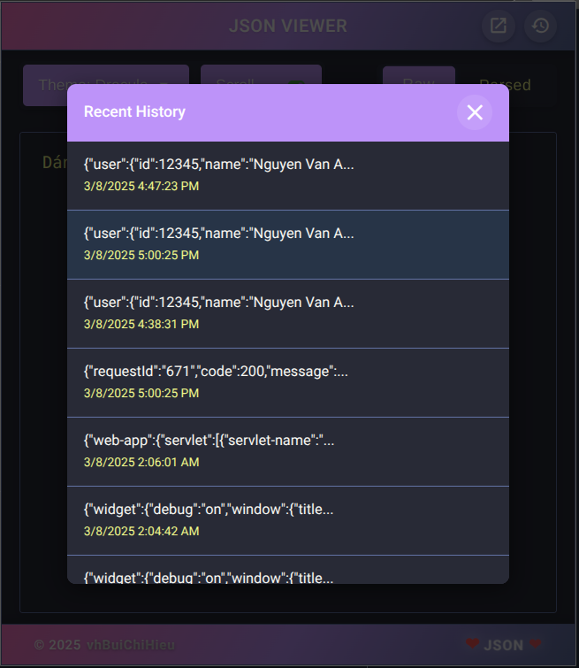
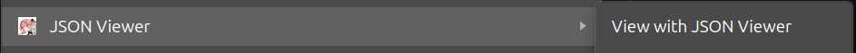

# JSON Viewer

<div align="center">
  
  <br><br>
  <p><strong>A powerful Chrome extension for formatting and visualizing JSON data</strong></p>
</div>

## 📋 Overview

JSON Viewer is a sleek, intuitive Chrome extension designed to help developers, data analysts, and anyone working with JSON data to easily format, parse, and visualize JSON content. With a clean interface and multiple viewing options, JSON Viewer makes working with complex JSON structures effortless.

<div align="center">
  
</div>

## ✨ Key Features

- **Dual Viewing Modes**: Switch between Raw and Parsed views for different analysis needs
- **Syntax Highlighting**: Color-coded JSON elements for improved readability
- **Multiple Themes**: Choose between Default, Dark, Light, Dracula, and Focus Dark themes
- **Simple Mode**: Toggle simplified view to hide brackets and quotes for cleaner visualization
- **JSON History**: Access recently formatted JSON data with one click
- **Context Menu Integration**: Right-click on any JSON text on a webpage to view it through the extension
- **Responsive Design**: Clean, modern interface with smooth transitions and animations
- **Clipboard Support**: Easy copy/paste functionality for working with JSON from various sources

## 🖼️ Screenshots

<div align="center">
  <p><strong>Editor View with Syntax Highlighting</strong></p>
  
  <br><br>
  
  <p><strong>JSON History Feature</strong></p>
  
  <p><em>Easily access your previously viewed JSON data with timestamps</em></p>
  <br>
  
  <p><strong>Context Menu Integration</strong></p>
  
  <p><em>Right-click on any JSON text to view it in popup or tab mode</em></p>
</div>

## 🛠️ Installation

1. Clone this repository or download the source code
   ```bash
   git clone <repository-url>
   ```

2. Open Chrome and navigate to `chrome://extensions/`

3. Enable "Developer mode" by toggling the switch in the top-right corner

4. Click "Load unpacked" and select the directory containing the extension files

5. The JSON Viewer icon will appear in your browser toolbar

## 🚀 Usage

### Basic Usage
1. Click the JSON Viewer icon in your browser toolbar
2. Paste or type your JSON data into the text area
3. Toggle between Raw and Parsed views using the buttons in the toolbar
4. Select a theme from the dropdown menu to change the appearance

### Context Menu Integration
1. Select JSON text on any webpage
2. Right-click and select "View with JSON Viewer" from the context menu
3. The extension popup will open with the selected text loaded
4. Alternatively, select "View with JSON Viewer (Tab)" to open in a new tab with enhanced features

### JSON History
1. Click the history icon in the header (clock icon)
2. Browse through your previously formatted JSON entries with timestamps
3. Click any entry to instantly load it into the editor
4. History is automatically saved and persisted between sessions

### Simple Mode (Tab View Only)
1. In the tab view, toggle the "Simple" button
2. This removes brackets, quotes, and commas for a cleaner visualization
3. Perfect for focusing on the data structure without syntax distractions
4. Toggle back to normal view at any time

## 🧰 Project Structure

```
json-viewer/
├── manifest.json       # Extension configuration
├── popup.html          # Main user interface
├── popup.js            # Core functionality and event handlers
├── editor.html         # Full-page editor interface
├── editor.js           # Editor functionality
├── editor.css          # Editor-specific styling
├── background.js       # Background scripts for context menu
├── styles.css          # Main styling
├── themes/             # Theme styling
│   ├── dark.css
│   ├── light.css
│   ├── dracula.css
│   └── focus-dark.css
└── icons/              # Extension icons
    ├── icon16.png
    ├── icon48.png
    └── icon128.png
```

## 🔧 Technologies Used

- **HTML5**: Structure of the extension popup and editor
- **CSS3**: Styling with variables for theming support
- **JavaScript**: Core functionality and DOM manipulation
- **Chrome Extension API**: Browser integration and storage

## 🔜 Roadmap

- Add JSON validation with detailed error messages
- Implement file import/export functionality
- Add search and filter capabilities for large JSON structures
- Support for more themes and customization options
- Optimize performance for handling very large JSON files
- Add JSON comparison tool for analyzing differences

## 📄 License

© 2025 vhBuiChiHieu - All Rights Reserved

---

<div align="center">
  <p>Made with ❤️ for developers and data enthusiasts</p>
</div>
